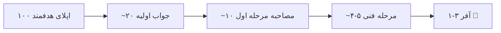

# فصل ۳ — جستجو، اپلای و پیگیری: قیف شانس را پهن کن

> 🎯 **هدف:** استخدام یک بازی **قیف** است: دیدن → اپلای → جواب → مصاحبه → آفر. یاد می‌گیری قیف را پهن و هوشمند مدیریت کنی — و با رد شدن‌ها کنار بیایی.

---

## ۳.۱ — قیف استخدام (واقعیت عددی)



این اعداد برای کاندیدای خوب هم است! پس: **رد شدن‌ها جزء فرمول‌اند.** اگر ۵ اپلای دادی و جواب نیامد، مشکل تو نیست — قیف تان باریک است؛ پهنش کن.

## ۳.۲ — کجا بگردیم؟ (کانال‌ها به ترتیب بازده)

| کانال | بازده | چطور |
|---|---|---|
| **معرفی (Referral)** ⭐⭐⭐ | بالاترین نرخ موفقیت | از آشنایان/هم‌دوره‌ای‌ها بپرس؛ پست لینکدین «به دنبال فرصت فرانت‌اند هستم» |
| **LinkedIn** ⭐⭐ | عالی | جستجوی شغلی + Open to Work + پیام مستقیم به hiring manager |
| **سایت‌های آگهی داخلی** ⭐⭐ | حجم بالا | فیلتر React/Next؛ هر روز چک |
| **سایت مستقیم شرکت‌ها** | خوب | شرکت‌هایی که دوست‌شان داری، بخش careers را مانیتور کن |
| **GitHub / open source** | بلندمدت | contribution = آفر بدون اپلای |
| **کامیونیتی‌ها (دیسکورد/تلگرام فنی)** | متوسط | فعال بودن = فرصت‌ها خودشان می‌آیند |

## ۳.۳ — پیام recruiter / hiring manager (قالب آماده)

وقتی مستقیم DM می‌دهی — کوتاه، شخصی، لینک‌دار:

```text
سلام [اسم]،

پروژه‌های [شرکت] رو دنبال می‌کردم — مخصوصاً [یک جزئیات واقعی
از محصولش]. من فرانت‌اند دولوپر با تمرکز روی Next.js و TypeScript
هستم؛ آخرین کارم [یک خط: چه ساختی + نتیجه].

پورتفولیو: [لینک] | گیت‌هاب: [لینک]

اگر فرصتی برای تیم‌تون هست، خوشحال می‌شم صحبت کنیم.
ممنون از وقت‌تون!
```

سه قانون: (۱) یک جزئیات واقعی از *آن* شرکت ذکر کن (کپی‌پیست لو می‌رود)، (۲) لینک پورتفولیو حتماً، (۳) کوتاه — زیر ۶ خط.

## ۳.۴ — مدیریت اپلای‌ها: جدول پیگیری (Spreadsheet!)

| شرکت | تاریخ اپلای | کانال | مرحله | پیگیری بعدی | یادداشت |
|---|---|---|---|---|---|
| شرکت A | 1 خرداد | LinkedIn | مصاحبه فنی | — | React + NestJS می‌خواهند |
| شرکت B | 2 خرداد | سایت | جواب نداده | 8 خرداد follow-up | remote-only |

چرا مهم است؟ (۱) یادت نمی‌ماند کی و کجا، (۲) **follow-up** قانون‌دار می‌شود: ۵-۷ روز بی‌جواب = یک ایمیل پیگیری کوتاه مودبانه (اغلب اپلیکیشن‌ها گم می‌شوند، نه رد)، (۳) الگوهای رد شدن را می‌بینی.

> 💡 **قانون ۲۴ ساعت:** هر مصاحبه‌ای که رفتی، همان روز در جدول بنویس چه پرسیدند — سوال‌ها تجمع می‌شوند و مصاحبه‌های بعدی‌ات را می‌سازند (دیتابیس شخصی سوالات!).

## ۳.۵ — Cover letter / پیام اپلای: کوتاه و شخصی

بیشتر جاها cover letter کامل نمی‌خواهند — یک پاراگراف هوشمند کافی است:

```text
سلام، برای موقعیت فرانت‌اند درخواست می‌دهم.

سه سال است با React و Next.js کار می‌کنم و تازه‌ترین پروژه‌ام
(دپلوی‌شده: [لینک]) یک فروشگاه کامل با SSR و درگاه پرداخت است.
در آگهی به پرفورمنس اشاره کرده بودید — همین موضوع تمرکز اصلی
من بوده (Lighthouse ۹۵+ روی هر سه پروژه‌ی اخیرم).

رزومه: [لینک] — خوشحال می‌شوم صحبت کنیم.
```

الگو: **موقعیت را نام ببر → یک تطابق مشخص → یک شاهد عددی → دعوت به گفتگو.** چهار جمله. تمام.

---

## ✅ جمع‌بندی فصل

- قیف واقعی: ۱۰۰ اپلای ← ۱-۳ آفر؛ رد شدن‌ها فرمول‌اند
- کانال‌ها به ترتیب بازده: Referral ← LinkedIn ← سایت‌ها ← مستقیم ← کامیونیتی
- پیام مستقیم: زیر ۶ خط + جزئیات واقعی شرکت + لینک‌ها
- جدول پیگیری + قانون ۲۴ ساعت (ثبت سوال‌ها!) + follow-up بعد ۵-۷ روز
- Cover letter = ۴ جمله: موقعیت + تطابق + عدد + دعوت

## 📝 تمرین فصل ۳

1. جدول پیگیری اپلای را در گوگل‌شیت بساز با ستون‌های فصل — از امروز پرش کن.
2. پیام DM به دو شرکت واقعی (که واقعاً می‌خواهی) بفرست — هر کدام با یک جزئیات متفاوت.
3. یک پاراگراف cover letter برای آگهی مورد علاقه‌ات بنویس — قالب ۴ جمله.
4. ۵ شرکت که محصولاتش را دوست داری لیست کن و صفحات careers‌شان را bookmark کن.
5. (روانی) یک پست لینکدین «به دنبال فرصت» بنویس — با لینک پورتفولیو.

<details><summary>نمونه تمرین ۴-۵</summary>

شرکت‌ها: مثلاً دو فروشگاه آنلاین که UX خوبی دارند + یک سرویس SaaS داخلی + یک استودیو محصول + یک شرکت بلیط/سفر. چرا؟ چون «دوست داشتن محصول» در مصاحبه به پاسخ‌های بهتر تبدیل می‌شود و مصاحبه‌گر حس می‌کند تو را *برای خودشان* می‌خواهد.

پست لینکدین نمونه: «چند ماهی است روی Next.js App Router تمرکز کردم — نتیجه‌اش این فروشگاه دموست که SSR، Server Actions و درگاه پرداخت دارد [لینک]. دنبال تیمی هستم که فرانت‌اند را جدی بگیرد. اگر جای مناسب می‌شناسید، خوشحال می‌شوم DM بدهید!» + اسکرین‌شات.
</details>

➡️ **فصل بعد:** نقشه مراحل مصاحبه — دقیقاً چه چیزی در هر مرحله رخ می‌دهد.
