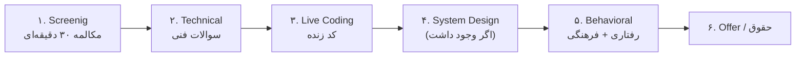

# فصل ۴ — مراحل مصاحبه: نقشه کامل میدان نبرد

> 🎯 **هدف:** بزرگ‌ترین منبع اضطراب، «ندانستن چه رخ می‌دهد» است. در این فصل کل خط لوله استخدام را قدم‌به‌قدم باز می‌کنیم — برای هر مرحله: چه می‌گذرد، چه می‌خواهند، چطور آماده شوی.

---

## ۴.۱ — نقشه کامل (مراحل معمول در شرکت‌ها)

⚠️ همه شرکت‌ها همه مراحل را ندارند — بسیاری از شرکت‌های داخلی: یک مکالمه فنی + یک جلسه با مدیر. برخی بین‌المللی‌ها: ۴-۵ مرحله در چند هفته. **همیشه در اولین کال بپرس: «فرایند مصاحبه چند مرحله دارد؟»** — این سوال هم معلومات می‌دهد هم آرامش.

## ۴.۲ — مرحله ۱: Screening (مکالمه اول)

**چه می‌گذرد:** ۲۰-۳۰ دقیقه با recruiter یا لید — درباره‌ی تو (مسیر، تجربه، انتظار حقوق) و درباره‌ی آن‌ها (شغل، تیم).

**چه می‌سنجند:** ارتباط رزومه با شغل + ارتباط کلامی + انگیزه.

**چیکار کنی:**
- «خودت را معرفی کن» را **آماده داشته باش** (۲ دقیقه — فصل ۱۰ قالب کامل دارد)
- حقوق را در این مرحله می‌توانی بازه بگویی؛ یا بپرسی «رنج آگهی چیست؟»
- ۲-۳ سوال بپرس (فصل ۱۱) — حتی در screening، سوال‌پرسیدن = امتیاز

**جمله‌های کلیدی:** «چرا این شرکت؟» → جوابت باید حاوی یک واقعیت درباره‌ی *آن* شرکت باشد (محصولش را دیده‌ای، مشکلش را می‌فهمی) — نه «شرکت بزرگی است».

## ۴.۳ — مرحله ۲: Technical (سوالات فنی)

**چه می‌گذرد:** ۴۵-۶۰ دقیقه سوالات React/Next/JS/TS — معمولاً گفتگویی، گاهی با share screen و باز کردن کد.

**چه می‌سنجند:** عمق واقعی (نه حفظیات)، تجربه‌ی عملی، مرزهای دانش‌ات.

**چیکار کنی:**
- فصل‌های ۵ تا ۷ همین دوره = مخزن سوال‌ها — **جواب‌ها را بلند تمرین کن**
- از تجربه‌ی واقعی مثال بزن: هر جواب فنی + یک «در پروژه‌ی X من...» = امتیاز طلایی
- سوال ندانسته؟ قالب فصل ۱ (Thinking Out Loud + قدم ۵)

## ۴.۴ — مرحله ۳: Live Coding (کد زنده)

**چه می‌گذرد:** یک مساله کوچک را زنده می‌نویسی (در CodeSandbox/ادیتور اشتراکی) — مثلاً debounce، کامپوننت با fetch، فیلتر لیست.

**چه می‌سنجند:** فرایند فکر + عادت‌های کدنویسی + برخورد با گیر کردن — **نه فقط جواب نهایی.**

**چیکار کنی:** فصل ۸ همین دوره — ۸ تمرین رایج با کد کامل + پروتکل رفتار در حین کدنویسی (بلند فکر کن، سوال بپرس، تست با مثال).

## ۴.۵ — مرحله ۴: System Design (برای mid+)

**چه می‌گذرد:** «یک کامپوننت X را طراحی کن» یا «یک اپ Y چطور معماری می‌شود؟» — بدون کد، با دیاگرام و trade-off.

**چه می‌سنجند:** تفکر کلان، آگاهی از trade-off ها، سوال‌پرسیدن قبل از حل.

**چیکار کنی:** فصل ۹ — دو پاسخ نمونه کامل.

## ۴.۶ — مرحله ۵: Behavioral (رفتاری)

**چه می‌گذرد:** «تعارض را چطور حل کردی؟»، «یک شکست را بگو» — با لید/مدیر.

**چه می‌سنجند:** قابل‌همکاری بودن، مسئولیت‌پذیری، خودآگاهی.

**چیکار کنی:** فصل ۱۰ — STAR + ۴ جواب نمونه کامل آماده.

## ۴.۷ — جدول آمادگی سریع (قبل هر مصاحبه)

| اگر فردا این مرحله است | امشب این را تمرین کن |
|---|---|
| Screening | معرفی ۲ دقیقه‌ای + تحقیق محصول شرکت + ۳ سوال |
| Technical | فصل ۵-۷ را بلند مرور کن؛ دوتا جواب React را کامل بگو |
| Live Coding | فصل ۸: دو تمرین با تایمر ۲۰ دقیقه |
| System Design | فصل ۹: یک طراحی کامل بلند بگو |
| Behavioral | ۴ جواب STAR آماده + سوالات تو |

---

## ✅ جمع‌بندی فصل

- شش مرحله: screening → technical → live coding → system design → behavioral → offer
- «فرایند چند مرحله دارد؟» = اولین سوال هر مصاحبه
- هر مرحله یک مهارت می‌سنجد — آماده‌سازی متفاوت می‌خواهد
- جدول ۴.۷ = برنامه شب قبل هر مرحله

## 📝 تمرین فصل ۴

1. خودت را در موقعیت فرضی بگذار: سه مرحله‌ی بعدی‌ات را برای شرکت فرضی «دیجی‌استور» برنامه‌ریزی کن (چه تمرینی، کدام فصل).
2. جواب «چرا دیجی‌استور؟» را بنویس — با یک واقعیت واقعی از محصولش (برو سایزش را ببین!).
3. سوال حقوق را در screening چطور باز می‌کنی؟ سه جمله بنویس (راهنما: فصل ۱۱).
4. برای هر مرحله، «بزرگ‌ترین خطای ممکن» را بنویس — خودآگاهی = نصف آمادگی.

نمونه جواب تمرین ۴

سه مرحله‌ی من: (۱) Technical با سوالات React → امشب فصل ۶ را بلند تمرین می‌کنم؛ (۲) Live coding → فردا دو تمرین فصل ۸ با تایمر؛ (۳) Behavioral → جمعه ۴ جواب STAR را مرور می‌کنم.

جواب «چرا دیجی‌استور؟»: «سبد خرید و فیلترهایتان را تست کردم — تجربه موبایل‌تان عالی است ولی می‌دیدم صفحه جزئیات محصول CSR کامل است؛ با تجربه SSR/ISR در Next.js می‌توانم سئو و سرعت اولیه‌اش را بهتر کنم.»

خطاهای ممکن هر مرحله: screening = نپرسیدن هیچ سوال و گفتن حقوق خیلی دقیق؛ technical = جواب بلوف؛ live coding = سکوت و کدنویسی بی‌توضیح؛ behavioral = انتقاد از شرکت قبلی؛ نهایی = نگفتن حقوق و بستن بدون تاریخ.

➡️ **فصل بعد:** سوالات JavaScript/TypeScript با جواب کامل — شروع بخش فنی!
