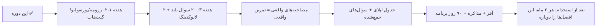

# فصل ۱۳ — چیت‌شیت نهایی، گلاساری و نقشه راه

> 🎯 **هدف:** همه‌چیز که روز مصاحبه لازم داری در یک فصل — چک‌لیست‌ها، جواب‌های آماده، گلاساری و نقشه راه.

---

## ۱۳.۱ — چک‌لیست هفته قبل از مصاحبه

- [ ] شرکت را تحقیق کن: محصول (واقعاً استفاده کن!)، اخبار، team، glassdoor-like نظرات
- [ ] رزومه‌ای که فرستادی را دوباره بخوان — سوالات از دل آن می‌آیند!
- [ ] سه پروژه پرچمدارت: What/Why/How/چالش — آماده تعریف
- [ ] فصل ۵-۷ (سوالات فنی) را بلند مرور کن
- [ ] ۴ جواب STAR را مرور کن (فصل ۱۰)
- [ ] ۳ سوال برای پرسیدن آماده کن (فصل ۱۱)
- [ ] حقوق: بازار را چک کن، بازه‌ات را بنویس
- [ ] تمرین: یک live coding با تایمر + یک مصاحبه شبیه‌سازی

## ۱۳.۲ — چک‌لیست روز مصاحبه

- [ ] ۱ ساعت قبل: تجهیزات (آنلاین)/مسیر (حضوری)، چیت‌شیت نیم‌صفحه، آب
- [ ] ۲۰ دقیقه قبل: warm-up (کد یا داکیومنت)
- [ ] ۵ دقیقه قبل: تنفس ۴-۷-۸ + جمله لنگر
- [ ] حین مصاحبه: Thinking Out Loud (۵ قدم) + سوال بپرس + «نمی‌دانم» حرفه‌ای
- [ ] آخر: ۲ سوال بپرس + «قدم بعدی فرایند چیست؟»
- [ ] همان روز: یادداشت سوال‌ها + ایمیل follow-up

## ۱۳.۳ — جواب‌های آماده (خلاصه فصل‌های ۱۰-۱۲)

| موقعیت | جمله کلیدی |
|---|---|
| «خودت را معرفی کن» | مسیر + تخصص + یک دستاورد عددی + چرا اینجا (۲ دقیقه) |
| «نمی‌دانی؟» | «X را بلد نیستم — ولی Y را می‌دانم که نزدیک است و برای X این‌طور می‌فهمم...» |
| «چرا ما؟» | یک واقعیت از محصولشان + تطابق با مهارتت |
| «شکست؟» | اشتباه واقعی + اصلاح سیستمی + درس (فصل ۱۰) |
| «حقوق؟» | «رنج شما؟» → بازه تحقیق‌شده → «بخش دیگری از پکیج؟» |
| «سوال داری؟» | «موفقیت سه ماه اول؟» + چالش فنی تیم + ساختار |

## ۱۳.۴ — گلاساری فرایند استخدام

| اصطلاح | یعنی |
|---|---|
| JD / job posting | شرح شغل |
| screening | مکالمه غربال اولیه |
| technical / live coding / system design | مراحل فنی |
| behavioral + STAR | رفتاری + قالب جواب |
| hiring manager / recruiter | مدیر استخدام / جذب‌کار |
| take-home | پروژه خانه |
| whiteboard / pair programming | تخته‌ای / جفتی |
| offer / negotiate | پیشنهاد / مذاکره |
| base / bonus / equity | پایه / پاداش / سهام |
| notice period / probation | اطلاع قبلی / آزمایشی |
| onboarding / onboarding buddy | ورود / راهنمای روز اول |
| follow-up / rejection / counter-offer | پیگیری / رد / پیشنهاد متقابل |
| red flag | پرچم قرمز |
| imposter syndrome | سندروم دغل‌کار |
| thinking out loud | بلند فکر کردن |
| STAR | Situation-Task-Action-Result |
| YoE | years of experience |

## ۱۳.۵ — نقشه راه پس از این دوره

**سه توصیه پایانی:**

1. **مصاحبه = مهارت، نه بخت:** مثل هر مهارتی با تکرار ساخته می‌شود — مصاحبه‌ی شبیه‌سازی‌شده با دوست، مؤثرتر از ۱۰ ساعت خواندن سوال است.
2. **دیتابیس سوال‌ها = گنج تو:** هر مصاحبه (حتی رد شده) سوال‌هایش را ثبت کن — بعد از ۵ مصاحبه، لیست سوالات شخصی‌ات دقیق‌تر از هر سایت است.
3. **پس از استخدام هم این دوره زنده است:** هر بار خواستی شغل عوض کنی، همین چرخه (رزومه → قیف → مراحل → مذاکره) دوباره اجرا می‌شود — فقط هر بار مسلط‌تر.

**پایان دوره:** تو حالا رزومه‌ی بهینه، قیف اپلای، جواب‌های ۸۹ سوالی، قالب STAR، سوالات خودت و برنامه ۹۰ روز داری. ترس مصاحبه از «ناشناخته» می‌آمد — و تو دیگر هیچ‌چیز ناشناخته‌ای نداری. برو و آن گفت‌وگوی دوطرفه را برگزار کن! 💪🎤 (و در ادامه، فصل‌های ۱۴ و ۱۵ — ۳۵ سوال تکمیلی HTML/CSS و تله‌های JS از ریپوهای مرجع — گرم‌کننده‌ی هر مصاحبه‌ات خواهند بود.)
